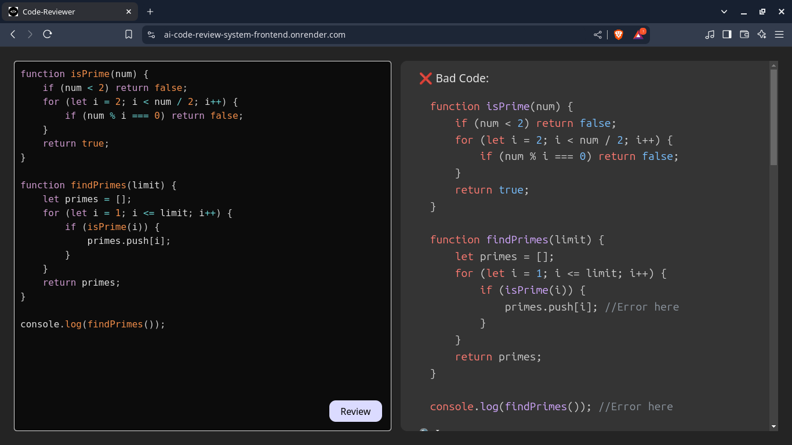

# 🚀 AI Code Review System – Smarter Code Reviews with AI  

An intelligent **AI-powered code review platform** that analyzes your code, detects errors, suggests optimizations, and enhances maintainability – all in seconds!  

🔗 **Live Demo:** [AI Code Review System](https://ai-code-review-system-frontend.onrender.com)  

⚠ **Note:** The backend is hosted on a free service, so responses may take some time (up to a minute).  

---

## ✨ Key Features & Achievements  
🛠 **Full-Stack Development** – Built with **React.js** (frontend) & **Node.js** (backend).  
🤖 **AI-Powered Reviews** – Uses **Google Gemini API** to analyze code quality.  
📈 **Performance Optimization** – Detects errors, suggests improvements, and enhances maintainability.  
🔄 **Cross-Origin Support** – CORS enabled for secure frontend-backend communication.  
⚡ **Fast & User-Friendly** – Simple interface for seamless code reviews.  

---

## 📷 Screenshot


## 🛠 Tech Stack  
### **Frontend:**  
- **React.js** – Modern UI & interactive components  .

### **Backend:**  
- **Node.js & Express.js** – Handles API requests & business logic  
- **CORS** – Ensures secure data exchange  

### **AI Integration:**  
- **Google Gemini API** – AI-driven code analysis  

---

## 🔧 Installation & Setup  
1. **Clone the repository**  
   ```sh
   git clone https://github.com/your-username/AI-Code-Review-System.git
   cd AI-Code-Review-System
